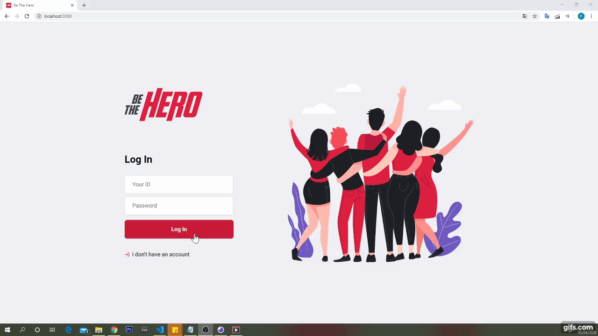

# BE THE HERO

This sample app was created at the event "Semana Omnistack" 11th edition, a week-long coding challenge organized by [Rocketseat](https://rocketseat.com.br/), with some modifications.

## Authors

- [Julio Oliveira](https://github.com/julio-0)

## Contents

1. [Overview](#overview)
2. [The idea](#the-idea)
3. [How it works](#how-it-works)
4. [Images](#images)
5. [Technology](#technology)
6. [Getting started](#getting-started)
7. [License](#license)

## Overview

### What it is?

It is an application developed for learning purposes, presenting a portfolio and alerting to a social cause. Although small, it is a full stack application with rest api on the backend accessing a SQL database, a web app built with React Js and a mobile app developed with React Native and Expo. It includes Localization and Jwt Authentication.

## The idea

The goal is to provide an app that engages volunteers to help financially a charity and contribute with causes like abandoned or injured animals. This allows "Heroes" to contact NGOs and donate money or offer volunteer work to help in specific cases.

## How it works

An NGO accesses the web app and, after making a registration and sign in, it can add the incidents in which it needs financial help.

A Volunteer (the Hero, who can be anyone) accesses the mobile app and selects an incident to help. Then, they reach the details of the incident and have access to contact options, by whatsapp or email, and the app deep links the registered whastapp or email client on the mobile device with a predefined message, in which he is willing to help. He sends a message and saves the day.

## Images

## Technology

- [Node.js](https://nodejs.org/en/)
- [Reactjs](https://reactjs.org/docs/getting-started.html)
- [React Native](https://reactnative.dev/docs/getting-started.html)
- [Expo](https://expo.io/)
- [Express](https://expressjs.com/)
- [Nodemon](https://www.npmjs.com/package/nodemon)
- [Axios](https://www.npmjs.com/package/axios)
- [Cors](https://www.npmjs.com/package/cors)
- [Jwt](https://www.npmjs.com/package/jsonwebtoken)
- [Jest](https://www.npmjs.com/package/jest)
- [Supertest](https://www.npmjs.com/package/supertest)
- [Intl](https://www.npmjs.com/package/intl)
- [i18next](https://www.i18next.com/)

## Getting started

### Prerequisites

- Install React dependencies:
    - [Node.js](https://nodejs.org/en/)
    - [Expo](https://expo.io/)

- Clone the [repository](https://github.com/julio-0/be-the-hero).

### Steps

1. [Run the server](#4-run-the-server).
1. [Run the web application](#5-run-the-web-application).
1. [Run the mobile application](#6-run-the-mobile-application).

### 4. Run the server

To set up and launch the server application:

1. From a terminal:
    1. Go to the `bethehero/backend` directory of the cloned repo.
    1. Install the dependencies: `npm install`.
    1. Launch the server application:
        1. Start the application: `npm start`.
        1. The server can be accessed at <http://localhost:3333>.

### 5. Run the web application

To run the web application:

1. From a terminal:
    1. Go to the `bethehero/frontend` directory of the cloned repo.
    1. Install the dependencies: `npm install`.
    1. Launch the web app: `npm start`. 
    1. The command will open your webbrowser at <http://localhost:3000>.

### 6. Run the mobile application

To run the mobile application (using the Expo):

1. From a terminal:
    1. Install [Expo](https://expo.io/) globally in your development enviroment.
    1. Go to the `bethehero/mobile` directory.
    1. Install the dependencies: `expo install`.
    1. Launch the metro tunel in your computer using expo: `expo start`. 

1. Install the Expo app in your android or ios mobile device.
    1. Launch the Expo app in your mobile device and Scan the QRCode. 

## License

This code is made available under the [MIT License](LICENSE).
